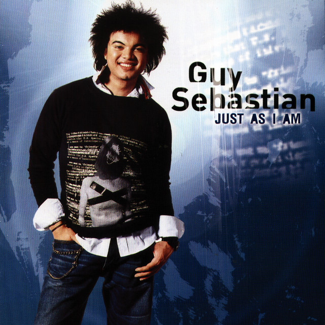
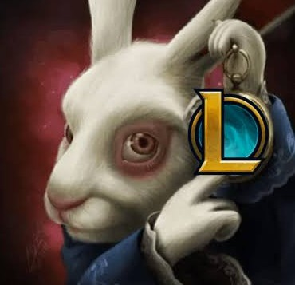

<!-- Profile Picture -->

# ✨ Hi, I'm Steven James P. Leosala 

### *BSIT 3rd Year Undergraduate | Software Developer & Tech Enthusiast*

  

---

### 🚀 About Me

* 🎯 **Currently studying:** Bachelor of Science in Information Technology (3rd Year).
* 💡 **Passionate about:** Full-stack development, crafting seamless user interfaces, and solving backend challenges.
* ⚡ **Fun fact:** Always experimenting with new frameworks, optimizing algorithms, and automating workflows.

---

### 💚 I Like

  <table>
    <tr>
      <td align="center" width="33%">
         
        <b>Music</b> 
        <i>My GUY.</i>
      </td>
      <td align="center" width="33%">
         
        <b>Food</b> 
        <i>I'mma Be Snacking.</i>
      </td>
      <td align="center" width="33%">
         
        <b>Games</b> 
        <i>Not A Fun Game.</i>
      </td>
    </tr>
  </table>

---

### 🧩 Mini Game Corner

  <!-- Bouncing Text Animation using SVG -->
  <svg width="100%" height="70" viewBox="0 0 600 70">
    
    <text x="300" y="30" class="bounce-text">Play a Ball Game!</text>
    <text x="300" y="55" class="sub-text">Test your skills right from your browser.</text>
  </svg>

  <!-- Bouncing Ball Animation -->
  

    
  

  
  

---

### 🛠️ Tech Stack & Skills

  

| Category | Technologies |
| :--- | :--- |
| **Languages** | Java, C#, C++, Python, PHP, JavaScript |
| **Web Tech** | HTML5, CSS3, Modern JavaScript |
| **Tools & Environments** | Git, VS Code, Figma, MySQL, Relational Databases |

---

### 📊 GitHub Stats & Metrics

  

 

  

---

### 🏆 Achievements & Trophies

  

---

### 📈 Most Used Languages

  

---

  <i>⚡ "Striving to write clean, elegant, and efficient code everyday."</i>

