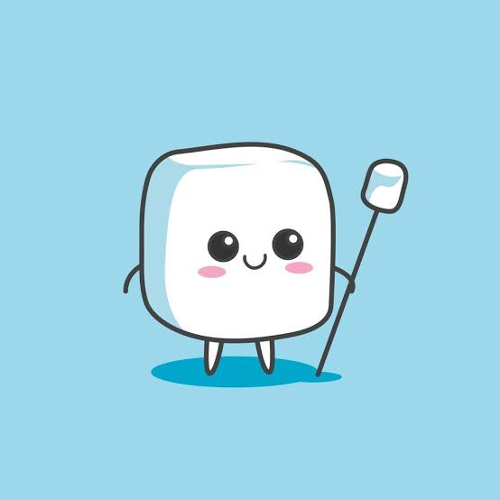

<table style="border: none !important; border-collapse: collapse !important; background: transparent !important;">
  <tr style="border: none !important; background: transparent !important;">
    <td align="center" valign="middle" style="border: none !important; padding-right: 25px; background: transparent !important;">
      
    </td>
    <td align="left" valign="middle" style="border: none !important; background: transparent !important;">
      

        
        
      

      

      

        <em>BSIT 3rd Year Undergraduate | Software Developer & Tech Enthusiast</em>
      

    </td>
  </tr>
</table>

 

  

---

### 🚀 About Me

* 🎯 **Currently studying:** Bachelor of Science in Information Technology (3rd Year).
* 💡 **Passionate about:** Full-stack development, crafting seamless user interfaces, and solving backend challenges.
* ⚡ **Fun fact:** Always experimenting with new frameworks, optimizing algorithms, and automating workflows.

---

### 💚 I Like

  <table style="margin-left: auto; margin-right: auto; border: none !important;">
    <tr>
      <td align="center" width="33%" style="border: none !important;">
         
        <b>Music</b> 
        <i>My GUY.</i>
      </td>
      <td align="center" width="33%" style="border: none !important;">
         
        <b>Food</b> 
        <i>I'mma Be Snacking.</i>
      </td>
      <td align="center" width="33%" style="border: none !important;">
         
        <b>Games</b> 
        <i>Not A Fun Game.</i>
      </td>
    </tr>
  </table>

---

### 🧩 Mini Game Corner

  ### 🏀 Play a Ball Game!
  > *Test your skills right from your browser.* 
  > *Click the button below to launch the arcade shootout!*

  

---

### 🐍 Snake Contribution Graph

<picture>
  <source media="(prefers-color-scheme: dark)" srcset="https://raw.githubusercontent.com/Genfentsu/Genfentsu/output/github-contribution-grid-snake-dark.svg">
  
</picture>

---

### 🛠️ Tech Stack & Skills

  

| Category | Technologies |
| :--- | :--- |
| **Languages** | Java, C#, C++, Python, PHP, JavaScript |
| **Web Tech** | HTML5, CSS3, Modern JavaScript |
| **Tools & Environments** | Git, VS Code, Figma, MySQL, Relational Databases |

---

### 📊 GitHub Stats & Summary Cards

  

  
  

  
  

  

---

### 🏆 Achievements

  

---

### 🌐 My Socials

  <!-- Instagram -->
  
  <!-- Facebook -->
  
  <!-- Gmail -->
  
  <!-- Discord -->
  

---

  <i> "Expecting The Unexpected — Makes the Unexpected Expecting."<</i>

